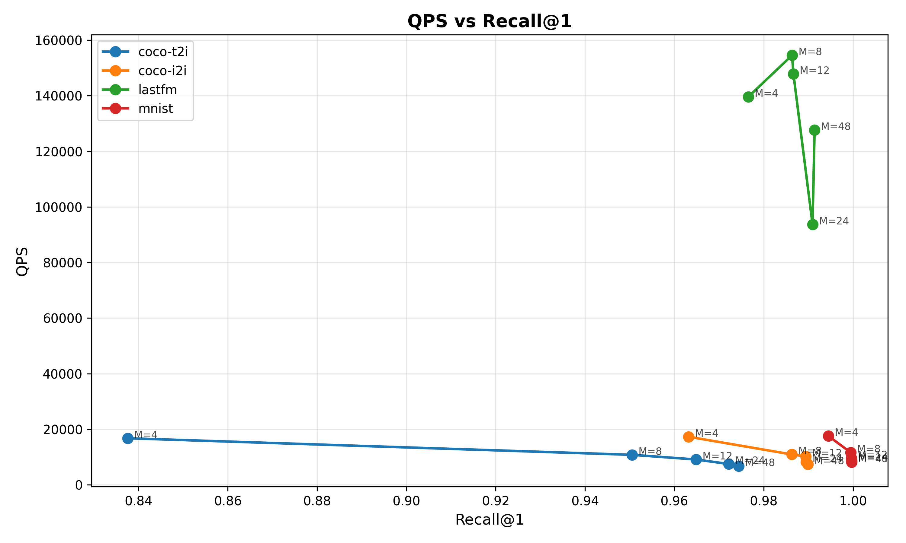
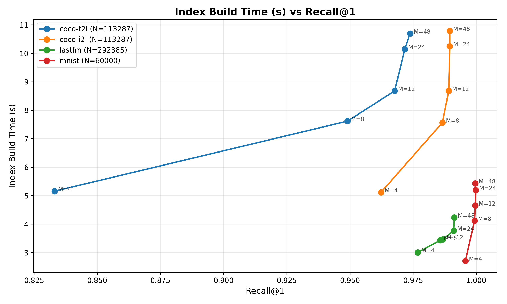

## Part 2 报告：HNSW 在不同数据集大小上的权衡

### 数据集规模

- coco-t2i: N=113287
- coco-i2i: N=113287
- lastfm: N=292385
- mnist: N=60000

### 图1：QPS vs Recall@1

- 横轴：Recall@1；纵轴：QPS。不同曲线代表不同数据集规模，点上标注为对应的 M 值。

### 图2：Index Build Time vs Recall@1

- 横轴：Recall@1；纵轴：索引构建时间（秒）。不同曲线代表不同数据集规模，点上标注为对应的 M 值。

### 简要分析

- 随 M 增大，Recall 提升但构建时间与查询代价上升，QPS 通常下降。

- 数据集越大，同等 M 下 Recall 较低且构建时间更长；需要更大的 M 才能达到相似 Recall。

- 需要在目标 Recall 与可接受吞吐/构建开销之间权衡，选择合适的 M。
